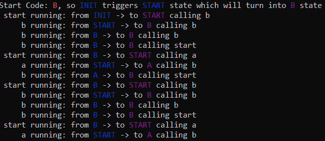

# Finit State Machine Demo

## TO MAKE

```bash
    #CC=['clang' or 'gcc' or 'cc']
    ${CC} -O3 -o fsm[.exe] main.c fsm.c
```

## TO RUN

```bash
    [/bin/sh] ./fsm[.exe]
```

*Note: '[...]' is optional.*

## PREDEFINED STATE TRANSITIONS *(from the **main.c**)*

```C
    ...
    StateTransition transitions[] = {
        {INIT, START, &start},          // INIT -> START
        {START, A, &a},                 // START -> A
        {START, B, &b},                 // START -> B
        {A, A, &a},                     // A -> A
        {A, B, &b},                     // A -> B
        {B, A, &a},                     // B -> A
        {B, B, &b},                     // B -> B
        {A, START, &start},             // A -> START
        {A, END, &a},                   // A -> END*
        {B, START, &start},             // B -> START
        {B, END, &b},                   // B -> END*
        {START, ERROR, &terminate},     // START -> ERROR*
        {A, ERROR, &terminate},         // A -> ERROR*
        {B, ERROR, &terminate},         // B -> ERROR*
        {-1, -1, NULL}                  // terminator
    };
    ...
```
**: these state transitions are not modelled in this demo...*

## EXAMPLE TRANSITION HANDLER *(from the main.c)*
```C
...
    int a(Environment *env) {
        printf("%14s: from \033[34m%s\033[0m -> to \033[35m%s\033[0m ", "a running", State[env->from_state_id], State[env->current_state_id]);
        TheEnvironment *env2;
        env2 = (TheEnvironment *)env;
        int r = (rand() % (100 - (0 + 1) + 0)); // srand initialized in the main function earlier...
        env2->exitCode = r;
        int ret = r > 63 ? A : r <= 63 && r > 33 ? B : START;   // one of the three handled states
        if (ret == A) printf("calling a\n");                    // in the next state this function will be called
        else if (ret == B) printf("calling b\n");               // ..
        else printf("calling start\n");
        return ret;                                             // the next state identifier
    }
...
```

## DEMO RUN OUTPUT

